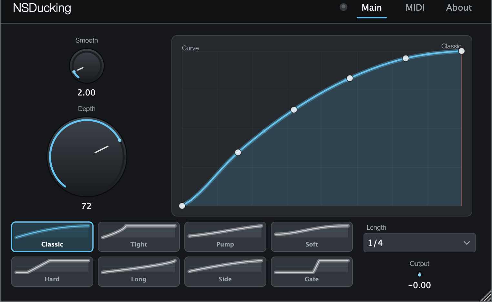
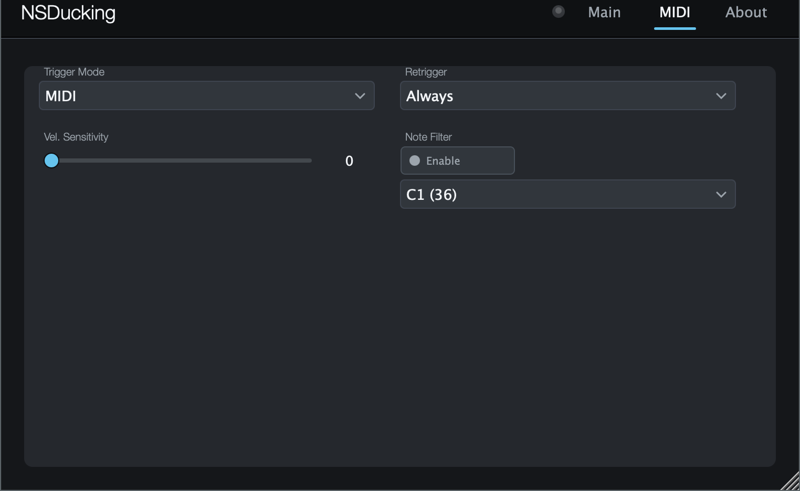
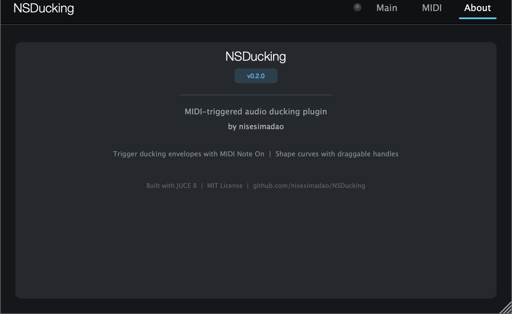

# NSDucking

**MIDI Note On でダッキングカーブを再生する、無料のオーディオ・ダッキングプラグイン**

VST3 / AU 対応 · JUCE 8 · macOS / Windows · MIT License

---

## スクリーンショット

### Main タブ — カーブエディターとプリセット



> ドットはドラッグで動かせるカーブ編集ハンドルです。赤い縦線はリアルタイム再生ヘッドです（MIDIトリガー後に流れます）。

### MIDI タブ — トリガー設定



### About タブ



---

## 特徴

| 機能 | 説明 |
|------|------|
| **MIDI トリガー** | 任意の MIDI Note On でダッキングエンベロープを先頭から再生 |
| **Host Sync** | DAW の再生位置に同期し、拍の頭で自動トリガー |
| **8 プリセットカーブ** | Classic / Tight / Pump / Soft / Hard / Long / Side / Gate |
| **カーブ編集** | Curve Editor 上のハンドルをドラッグして自由に波形を編集 |
| **Velocity Sensitivity** | MIDI ベロシティで Depth をスケール |
| **Retrigger Mode** | Always（常に再トリガー）/ Free Run（再生中はスキップ） |
| **Note Filter** | 特定の MIDI ノート番号だけに反応させる |
| **レスポンシブ UI** | ウィンドウサイズに応じてレイアウトを自動再計算 |
| **状態保存** | すべてのパラメータを DAW プロジェクト内に保存 |

---

## パラメータ

### Main タブ

| パラメータ | 範囲 | デフォルト | 説明 |
|-----------|------|-----------|------|
| **Depth** | 0〜100% | 72% | ダッキングの強さ。100% で最大ゲインリダクション |
| **Smooth** | 0〜20 ms | 2 ms | ゲイン変化のなめらかさ。クリックノイズ防止 |
| **Output Gain** | −12〜+12 dB | 0 dB | 出力音量の補正 |
| **Length** | 1/64〜1 bar | 1/4 | カーブ全体の長さ（DAW の BPM に同期） |

### MIDI タブ

| パラメータ | 説明 |
|-----------|------|
| **Trigger Mode** | MIDI / Host Sync |
| **Velocity Sensitivity** | ベロシティで Depth をスケールする割合（0% = 無効） |
| **Retrigger** | Always = 再生中でも再トリガー / Free Run = 終了後のみ |
| **Note Filter** | 有効にすると特定のノート番号だけに反応 |

---

## プリセットカーブ

```
Classic │▌▌▌▌▌░░░░░░░░░░  標準的なポンピング。強く下げてなめらかに戻る
Tight   │▌▌▌░░░░░░░░░░░░  ベース用の短いダック
Pump    │▌▌▌▌▌▌░░░░░░░░░  EDM 向け。Depth 高めで派手に動く
Soft    │▌▌░░░░░░░░░░░░░  自然なサイドチェイン風
Hard    │▌░░░░░░░░░░░░░░  急激に下げて急激に戻るゲート的な効果
Long    │▌▌▌▌▌▌▌▌░░░░░░░  ゆっくり戻る。パッドやロングベース向け
Side    │▌▌▌▌░░░░░░░░░░░  汎用的な中間カーブ
Gate    │▌░░░░░░░░░░░░░░  ほぼミュートに近い強いダック
```

---

## インストール

### 配布バイナリ（推奨）

[Releases ページ](https://github.com/nisesimadao/NSDucking/releases) から OS に合ったファイルをダウンロードしてください。

| ファイル | 対象 |
|--------|------|
| `NSDucking-vX.X.X-macOS-VST3.zip` | macOS VST3 対応 DAW（Ableton Live, Cubase など） |
| `NSDucking-vX.X.X-macOS-AU.zip` | macOS AU 対応 DAW（Logic Pro など） |

**macOS へのインストール:**

```sh
# VST3
unzip NSDucking-*-macOS-VST3.zip
cp -r VST3/NSDucking.vst3 ~/Library/Audio/Plug-Ins/VST3/

# AU (Audio Unit)
unzip NSDucking-*-macOS-AU.zip
cp -r AU/NSDucking.component ~/Library/Audio/Plug-Ins/Components/
```

インストール後、DAW でプラグインのスキャンを実行するとリストに表示されます。

> **注意**: 現在のビルドはアドホック署名です。macOS Gatekeeper の警告が出た場合は `xattr -dr com.apple.quarantine NSDucking.vst3` で解除してください。

---

## DAW ごとの MIDI ルーティング

| DAW | 方法 |
|-----|------|
| **Ableton Live** | エフェクトトラックに挿入し、MIDI トラックの Output を当該トラックへルーティング |
| **Cubase / Nuendo** | Audio トラックに挿入 → インスペクタの MIDI Send で送信元を指定 |
| **Logic Pro** | オーディオトラックに `NSDucking (AU)` を挿入し、トラックに MIDI を流す |
| **FL Studio** | Mixer エフェクトスロットに挿入し、ピアノロールから MIDI を送信 |

> **Tip**: キックドラムの MIDI を複製してサイドチェインするのが最も手軽な使い方です。

---

## ソースからビルドする

**必要なもの**: CMake 3.22+, C++17 対応コンパイラ, Git

```sh
git clone https://github.com/nisesimadao/NSDucking.git
cd NSDucking

# ビルド（JUCE は自動ダウンロードされます）
cmake -S . -B build -DCMAKE_BUILD_TYPE=Release
cmake --build build --config Release

# スモークテスト（JUCE 不要、CurveLibrary だけ確認）
clang++ -std=c++17 -ISource Source/CurveLibrary.cpp tests/CurveSmoke.cpp -o /tmp/nsducking_smoke
/tmp/nsducking_smoke && echo "OK"
```

既存の JUCE を使う場合:

```sh
cmake -S . -B build -DNSDUCKING_FETCH_JUCE=OFF -DJUCE_DIR=/path/to/JUCE
```

---

## ライセンス

MIT License — 詳細は [LICENSE](LICENSE) を参照してください。

